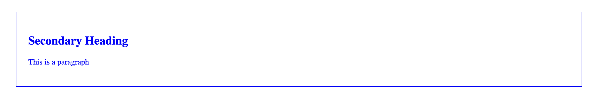
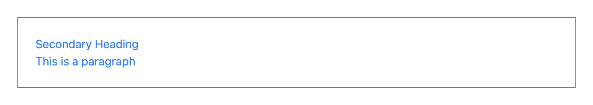
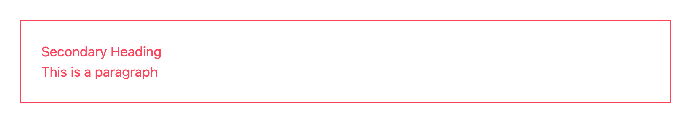
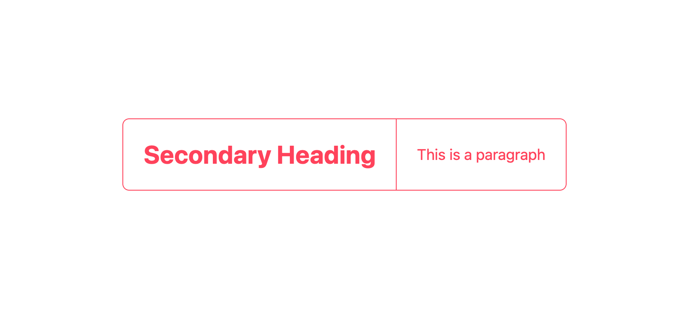
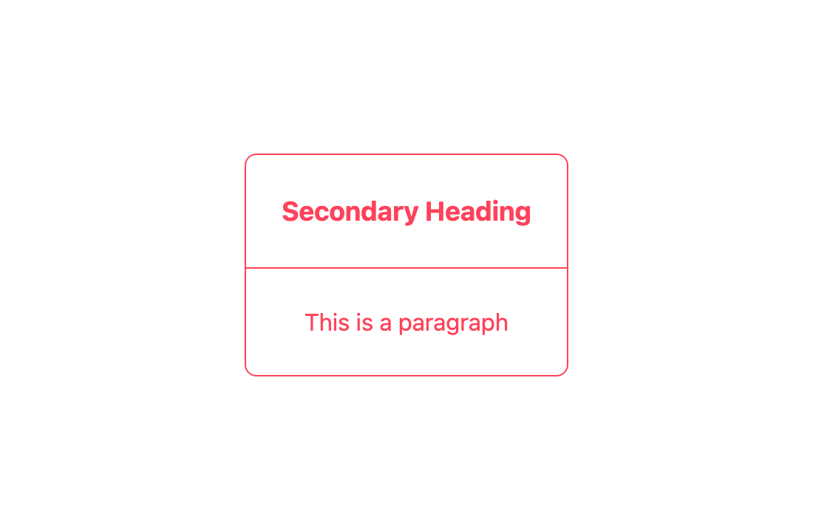
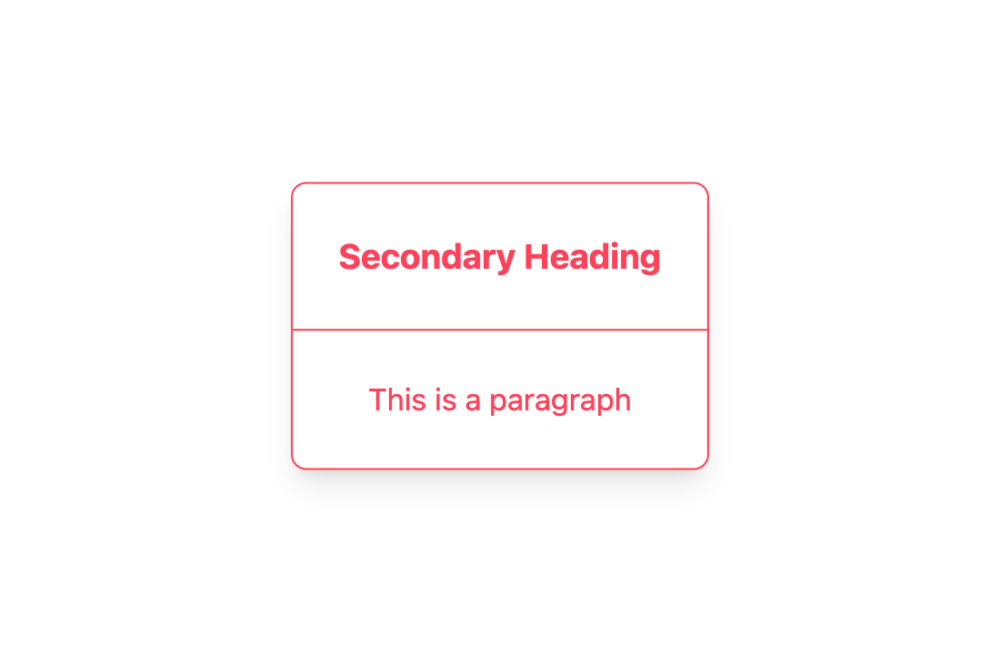

### Refresher to html and css:

You can think of a browser as a “layout engine”, it accepts data and renders an interface.

css and html are a large part of the data browsers consume.

html is a “markup language” that consists of opening and closing tags:

```html
<p>I’m a paragraph</p>
```

Here, the opening tag is `<p>` and the closing tag is `</p>`. The only difference is the closing tag has a slash after `<`. Open tags must always have a closing tag, otherwise the browser will have a hard time distinguishing the contents of one tag from another and the page might not render.

Tags can contain other tags and have attributes:

```html
<div class="intro-section">
    <h2>Secondary Heading</h2>
    <p>This is a paragraph</p>
</div>
``` 

Here, a `div` with the `class` attribute contains a `h2` tag and a `p` tag. We will talk about what the `class` attribute does soon.

Tags typically correspond to content on a page, like text, images, videos, or containers for more tags like `div` in the example above. In fact, `div` is probably the most common tag as it is used to contain, position and style other kinds of content. Look [here](https://developer.mozilla.org/en-US/docs/Web/html/Element) for a full list of tags.

While html mainly defines content, css mostly defines how this content appears in the browser. For example, you can use css to position elements, set the border radius and drop shadows, typeset text, define colours and much more. 

css can be written inside an html file or in a separate file which is referenced inside the html file. For now, we will write all our css inside our html file, in a tag called `style`:

```html
<style>
    .intro-section {
        margin: 24px;
        padding: 24px;
        color: blue;
        border: 1px solid;
        border-color: blue;
    }
</style>
```

Here we've just defined a css "class". A class starts with a full stop `.` and a string of characters with no spaces (this is its name), followed by a list of properties enclosed by curly braces. In this example, we create a class called `intro-section` and set the `margin` and `padding` to `24px`, set the text `color` (not colour) to `blue`, and made a `1px solid` border and set it to `blue`. You can view a full list of css attributes [here](https://developer.mozilla.org/en-US/docs/Web/css/Reference). We can now use this css class on our html elements with the `class` property, like our earlier example. You can reference multiple classes by separating them with spaces like so: `class="class-1 class-2 class-three"`. 

Let's combine this all and make our first html page. Make things easier by using a code editor like VSCode: https://code.visualstudio.com/. This will give you syntax highlighting and lots of other nice ergonimic things. So, make or open a folder and add a file called `index.html` in VSCode. Type `html` and notice how you get a dropdown? Use the down arrow key on your keyboard to highlight the `html:5` option and press the enter key. All these tags appear:

```html
<!DOCTYPE html>
<html lang="en">
<head>
  <meta charset="UTF-8">
  <meta name="viewport" content="width=device-width, initial-scale=1.0">
  <title>Document</title>
</head>
<body>
  
</body>
</html>
```

Cool right? That's VSCode's auto-completion helping us create our first html page. You can think about these initial tags as the essential tags you need to make a valid html page. We will be putting our tags in the `<body>` tag, this is where the content you see on a webage is, and mostly ignoring the `head` tag. This is generally for page metadata (for example, the `title` tag defines the name that appears in the browser tab bar for this page).

Now let's put our earlier tags in the body tag:

```html
<!DOCTYPE html>
<html lang="en">
<head>
  <meta charset="UTF-8">
  <meta name="viewport" content="width=device-width, initial-scale=1.0">
  <title>Document</title>
</head>
<body>
    <style>
        .intro-section {
          margin: 24px;
          padding: 24px;
          color: blue;
          border: 1px solid;
          border-color: blue;
        }
    </style>

    <div class="intro-section">
        <h2>Secondary Heading</h2>
        <p>This is a paragraph</p>
    </div>
</body>
</html>
```

And double click this `index.html` file we just created in your file system (finder if you're on osx) to view the page in your default browser. It should look like this:



Congrats on making your page! 

Notice how we used that class earlier: we called it "intro-section" and wrote a bunch of properties specific to the intro section element. Extending this way of thinking would lead us to create more elements, and write more classes for those elements, defining commonly used properties like margin and padding over and over. This works. But what about instead of doing that... we instead defined a css class for every single property instead? This sounds a bit mental but bear with me. Instead of what we put in our last page, what if we instead did this:

```html
<!DOCTYPE html>
<html lang="en">
<head>
  <meta charset="UTF-8">
  <meta name="viewport" content="width=device-width, initial-scale=1.0">
  <title>Document</title>
</head>
<body>
    <style>
        .m-24 {
          margin: 24px;
        }

        .p-24 {
            padding: 24px;
        }

        .text-blue {
            color: blue;
        }

        .border-blue {
          border-color: blue;
        }

        .border-1 {
            border: 1px solid;
        }
    </style>

    <div class="m-24 p-24 text-blue border-blue border-1">
        <h2>Secondary Heading</h2>
        <p>This is a paragraph</p>
    </div>
</body>
</html>
```

Paste this into the `index.html` file you just created, save it and refresh your browser. It should look like this:


It looks exactly the same right? So whats the point? Well... what if we could just automatically generate these classes? Better yet, what if we could automatially generate these classes according to a design system? Even better, what if we could generate _only the classes we actually use?_ This essentially what tailwindcss does: it looks through our html and generates the "atomic" css classes we've used. This is fantastic for so many reasons:

- It means we don't have to think about what styles should go into what css class
- And remembering which classes are used by what html tags when we need to make changes
- We can use standard predefined units in properties like margin, e.g `m-1` `m-2`, which correspond to units in a design system
- We can define these units in one place and generate all the css that use them, like `m-1` `m-2` for margin, but also `p-1` `p-2` for padding, and more...
- We can do the same with colours, breakpoints, layout properties, typography, all defined from one config file
- This config file can contain tokens that come from elsewhere, like Figma
- It's wayyy faster to write components using these atomic classes because they never change and the css you are editing lives in the affected html tag.
- It's much less verbose then defining classes yourself
- You can prefix modifiers on top of classes like `md:m-1` to only apply one unit of margin on the `md` (medium) breakpoint, or `hover:border hover:border-blue` to only apply the blue border when it's in the hover state. The ergonomics this provides cannot be understated. It literally makes writing complex adaptive/responsive UI fun.
- The generated css file is extremely small so our page loads fast
- Way more nice things, checkout https://tailwindcss.com/docs/installation to read the documentation

### Using Tailwind in our design

Ok so I hope I've now convinced you to use Tailwind. How can you get started? There are lots of ways you can include Tailwind in your project. The easiest way is to include it in a `<script>` tag in your html file, so lets rewrite our example page above with Tailwind:

```html
<!DOCTYPE html>
<html lang="en">
<head>
  <meta charset="UTF-8">
  <meta name="viewport" content="width=device-width, initial-scale=1.0">
  <title>Document</title>
  <script src="https://cdn.tailwindcss.com"></script>
</head>
<body>
    <div class="m-6 p-6 text-blue-500 border-blue-500 border">
        <h2>Secondary Heading</h2>
        <p>This is a paragraph</p>
    </div>
</body>
</html>
```

Now your page should look like this:



That's it, we're done. You can see we are now using `m-6` and `p-6` which in Tailwind's design system is equivalent to `24px`, and we are using the their default `blue-500` colour for our text and border. Pretty cool right? To make things even easier, you can install the VSCode plugin called [Tailwind CSS IntelliSense
](https://marketplace.visualstudio.com/items?itemName=bradlc.vscode-tailwindcss) which gives you autocomplete suggestions on Tailwind classes, made by the makers of Tailwind. It's extremely cool. Now you can smash out responsive designs in record time.

### Design tokens

So far we've used the blue defined in as part of Tailwinds defaults. How about including our own colours? We can override or extend the Tailwind defaults by including a default configuration like this:

```html
<!DOCTYPE html>
<html lang="en">
<head>
  <meta charset="UTF-8">
  <meta name="viewport" content="width=device-width, initial-scale=1.0">
  <title>Document</title>
  <script src="https://cdn.tailwindcss.com"></script>
  <script>
    tailwind.config = {
      theme: {
        extend: {
          colors: {
            "radical-red": '#ff425b',
          }
        }
      }
    }
  </script>
</head>
<body>
    <div class="m-6 p-6 text-radical-red border-radical-red border">
        <h2>Secondary Heading</h2>
        <p>This is a paragraph</p>
    </div>
</body>
</html>
```

Save and refresh the page. Now your page should look like this:



See how we've defined that colour in this configuration and now we can use it as a value for the text and the colour of the border right away? This is really convenient. There are plugins for Figma that let you export your color primitives so that you can use them inside Tailwind. You just take the exported "object" (the text contained in the curly braces) and replace or include it with the above configuration. Then you can start using them in your tailwind classes. You can define all kinds of defaults including typefaces and scales here.

Let's add some styling to our example above:

```html
<!DOCTYPE html>
<html lang="en" class="h-full">
<head>
  <meta charset="UTF-8">
  <meta name="viewport" content="width=device-width, initial-scale=1.0">
  <title>Document</title>
  <script src="https://cdn.tailwindcss.com"></script>
  <script>
    tailwind.config = {
      theme: {
        extend: {
          colors: {
            "radical-red": '#ff425b',
          }
        }
      }
    }
  </script>
</head>
<body class="flex justify-center h-full items-center">
    <div class="text-radical-red bg-white rounded-lg border-radical-red border items-center flex flex-col md:flex-row hover:scale-105 hover:shadow-lg transition-all">
        <h2 class="p-6 md:text-3xl text-lg font-bold lg:text-6xl md:border-b-0 border-b md:border-r border-radical-red">Secondary Heading</h2>
        <p class="md:text-lg h-full lg:text-3xl p-6">This is a paragraph</p>
    </div>
</body>
</html>
```

Save and refresh the page. Now your page should look like this when the page is wide:



And like this when the page is narrow:



And like this when you hover over it:



With these extra classes, we've now defined a weird interactive button that changes its layout depending on the screen width. If you've done this with plain css in the past, you might appreciate this terse yet readable syntax. The example above uses classes and properties we haven't covered, including "flex" which is a powerful way to define responsive layouts. I won't go into detail about this here, but you can read about it in the Tailwind docs and elsewhere online. 

When we write user interface, we usually use a library like "React" to create "components" that combine html and css like the above with javascript to render data and specify more complex behaviours. These components can then be reused across our app without duplicating css/html.

### Let's host our site

Now that we have our button thing, let's put it live. Make an account on Netlify: https://www.netlify.com/. Click the create new site button, and drag the folder with your `index.html` file onto the page. 

Done! :-)